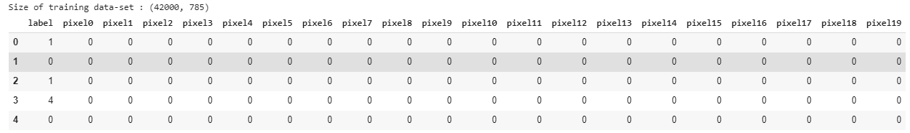
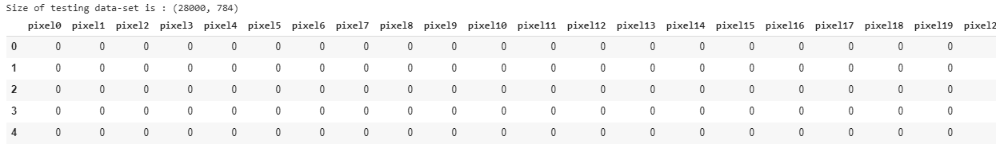
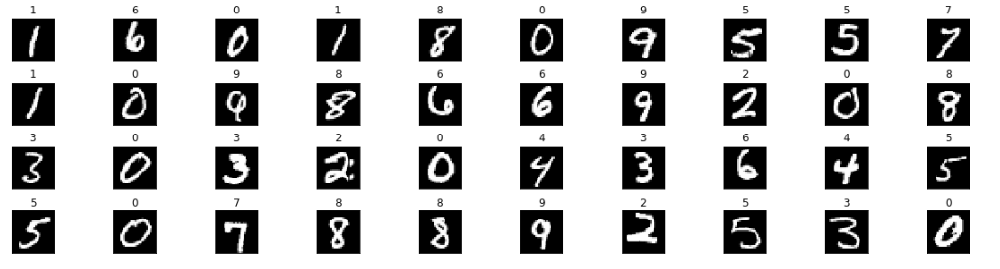
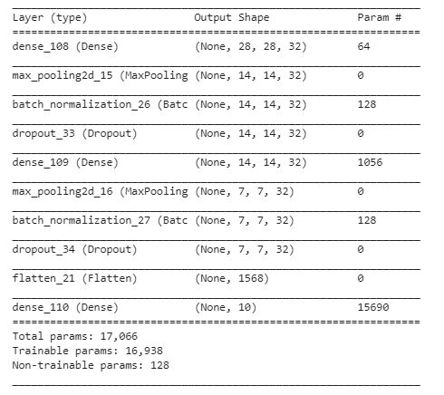
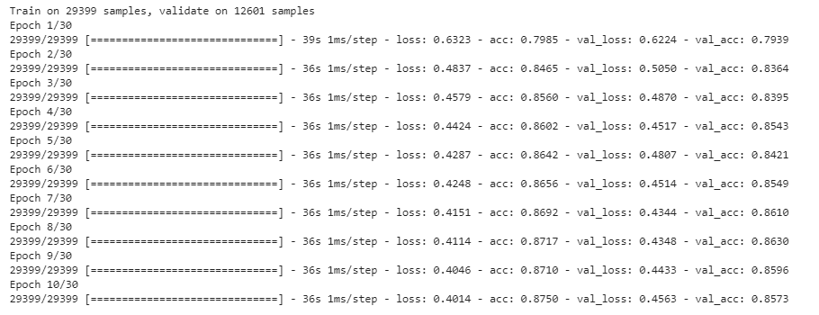
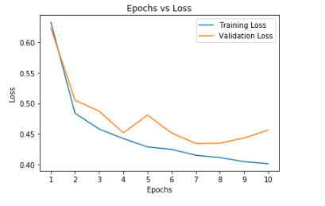
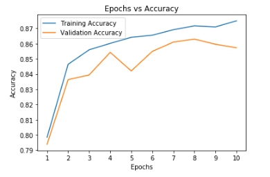
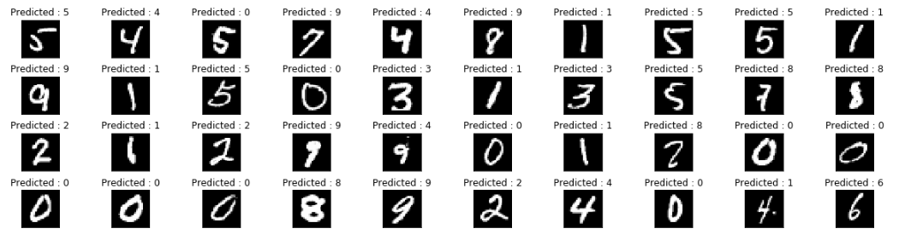

# Neural Network

__Neural networks__ are a set of algorithms, modeled loosely after the human brain, that are designed to recognize patterns. They interpret sensory data through a kind of machine perception, labeling or clustering raw input. The patterns they recognize are numerical, contained in vectors, into which all real-world data, be it images, sound, text or time series, must be translated.

The layers are made of __nodes__. A node is just a place where computation happens, loosely patterned on a neuron in the human brain, which fires when it encounters sufficient stimuli. 

  

___
A node layer is a row of those neuron-like switches that turn on or off as the input is fed through the net. Each layer’s output is simultaneously the subsequent layer’s input, starting from an initial input layer receiving your data.

  

Simply put, a neural network is a connected graph with input neurons, output neurons, and weighted edges. Let’s go into detail about some of these components:

__1) Neurons:__ A neural network is a graph of neurons. A neuron has inputs and outputs. Similarly, a neural network has inputs and outputs. The inputs and outputs of a neural network are represented by input neurons and output neurons.

__2) Connections and Weights:__ A neural network consists of connections, each connection transferring the output of a neuron to the input of another neuron. Each connection is assigned a weight.

__3) Propagation Function:__ The propagation function computes the input of a neuron from the outputs of predecessor neurons. The propagation function is leveraged during the forward propagation stage of training.

__4) Learning Rule:__ The learning rule is a function that modifies the weights of the connections. This serves to produce a favored output for a given input for the neural network. The learning rule is leveraged during the backward propagation stage of training.
___

__About Data__

  

  

  

  

  

  

  

  

