# Convolutional Neural Network (CNN) :

In neural networks, __Convolutional neural network (ConvNets or CNNs)__ is one of the main categories to do images recognition, images classifications. Objects detections, recognition faces etc., are some of the areas where CNNs are widely used.

CNN image classifications takes an input image, process it and classify it under certain categories (Eg. Infected and Uninfected cells). Computers sees an input image as array of pixels and it depends on the image resolution. Based on the image resolution, it will see __h x w x d( h = Height, w = Width, d = Dimension )__. Eg., An image of 6 x 6 x 3 array of matrix of RGB (3 refers to RGB values) and an image of 4 x 4 x 1 array of matrix of grayscale image.

The below figure is a complete flow of CNN to process an input image and classifies the objects based on values:

Convolution is the first layer to extract features from an input image. Convolution preserves the relationship between pixels by learning image features using small squares of input data. It is a mathematical operation that takes two inputs such as image matrix and a filter or kernal.

Consider a 5 x 5 whose image pixel values are 0, 1 and filter matrix 3 x 3 as shown in below:

Then the convolution of 5 x 5 image matrix multiplies with 3 x 3 filter matrix which is called __“Feature Map”__ as output shown in below:

Convolution of an image with different filters can perform operations such as edge detection, blur and sharpen by applying filters.

__Fully Connected Layer__

The layer we call as FC layer, we flattened our matrix into vector and feed it into a fully connected layer like neural network.

__About Data__

* Overview of Data
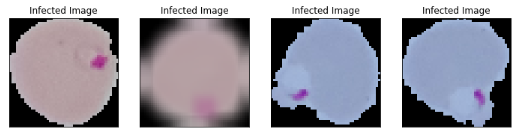  
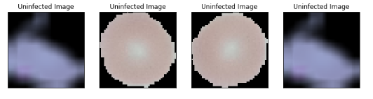  

* Comparision of Healthy and Infected Cells
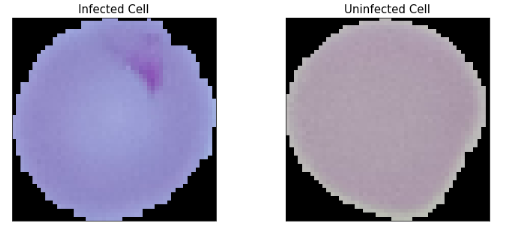  

* Dark Spot Identification
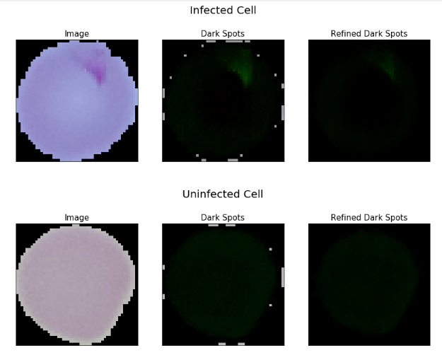  

* One Hot Encoding
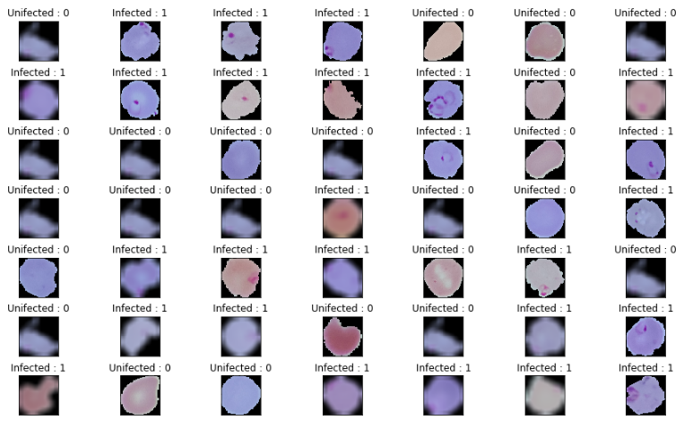  

* Splitting Dataset into Test-Train sample
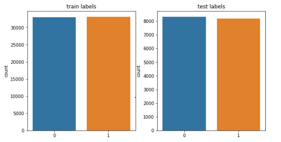  

___

__Model 1__

* Model Summary

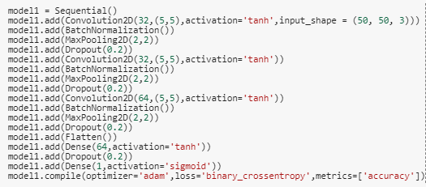  

* Confusion Matrix

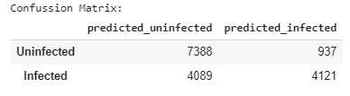  

* Classification Report

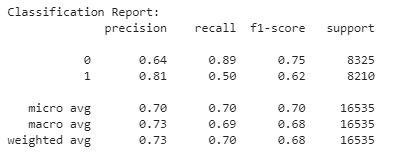  

* Epochs v/s Loss

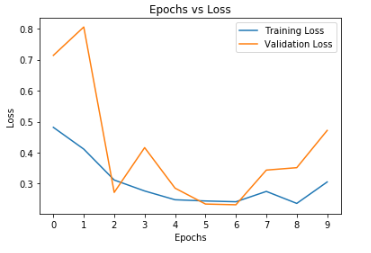  

* Epochs v/s Accuracy

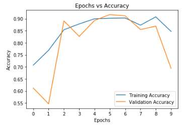  

__Model 2__

* Model Summary

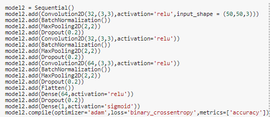  

* Confusion Matrix

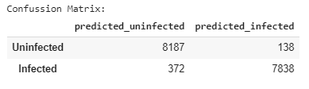  

* Classification Report

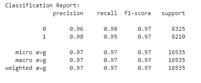  

* Epochs v/s Loss

  

* Epochs v/s Accuracy

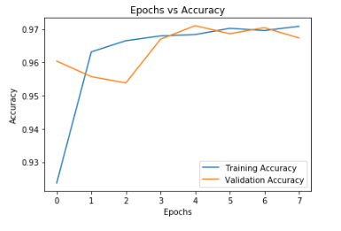  
