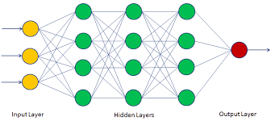
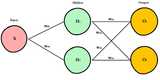

# Neural Network

__Neural networks__ are a set of algorithms, modeled loosely after the human brain, that are designed to recognize patterns. They interpret sensory data through a kind of machine perception, labeling or clustering raw input. The patterns they recognize are numerical, contained in vectors, into which all real-world data, be it images, sound, text or time series, must be translated.

The layers are made of __nodes__. A node is just a place where computation happens, loosely patterned on a neuron in the human brain, which fires when it encounters sufficient stimuli. 

  

___

A node layer is a row of those neuron-like switches that turn on or off as the input is fed through the net. Each layer’s output is simultaneously the subsequent layer’s input, starting from an initial input layer receiving your data.

  

## Why Neural Network?
The main advantages of using __Artificial Neural Networks (ANN)__ include: it can handle large amount of data sets; it has the ability to implicitly detect complex nonlinear relationships between dependent and independent variables; it has ability to detect all possible interactions between predictor variables; etc.

## Repository Overview
This repository is about different Neural Network algorithm approaches as per the industry practices.

## Table of Contents

- [Neural Classifier](#section1) 
- [Malaria Infected Cell Detection](#section2) 

___

### [Neural Classifier](./Neural_Classifier)
 * Classification of categories on basis of five features(i.e. actually reading of a particular instruments)
 * [Link for the Jupyter notebook](./Neural_Classifier/Analysis.ipynb)

### [Malaria Infected Cell Detection](./Infected_Cells_Detection)
 * Identification of Infected Malaria cells using CNN.
 * [Link for the Jupyter notebook](./Infected_Cells_Detection/Analysis.ipynb)
